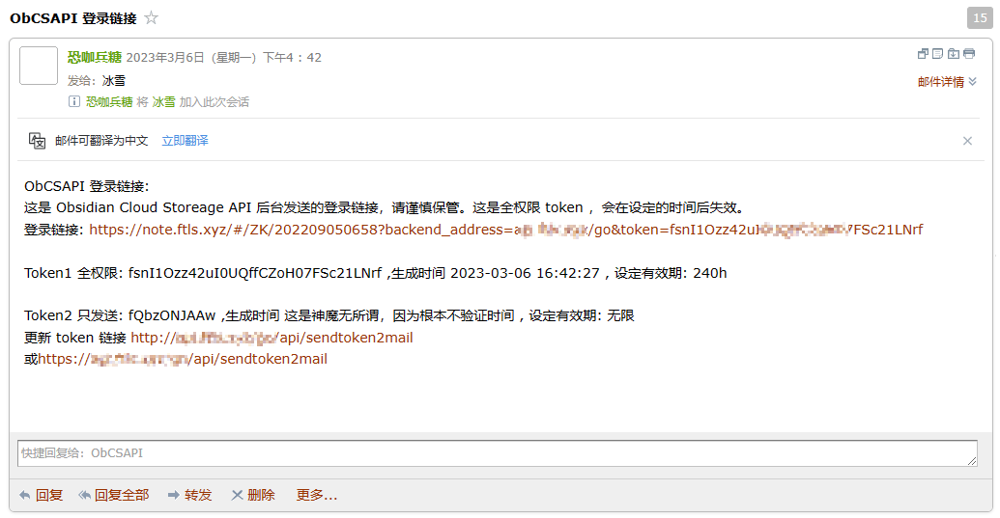
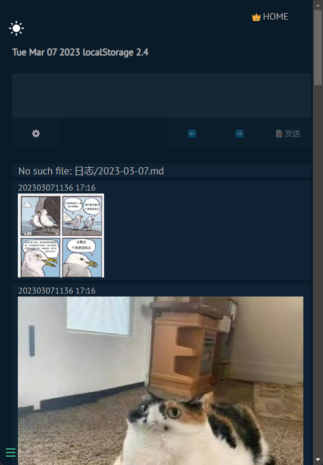

# Obsidian S3 存储的后端 API Golang 版本

python 老版本 https://gitee.com/kkbt/obsidian-csapi 相关说明可能算是更详细一点。可以借鉴一些其中的配置说明，和实际效果。

文档 Docs : [https://kkbt.gitee.io/obcsapi-go/#/](https://kkbt.gitee.io/obcsapi-go/#/)

基于 Obsidian S3 存储的后端 API ,保存到 S3 存储的 Obsidian 库。支持列表

一个简易前端（后有图）
微信测试号 微信到Obsidian  
支持简悦 SimpRead Webook  
支持 fv悬浮球文字图片分享保存  
静读天下 MoonReader 高亮标注 仿 ReadWise API  
通用 http api  
邮件发送登录链接


后端定时更换 Token 。实现了一个邮件发送登录链接，从而实现前端登录。

两种 token 
1. 全权限 token 包括增删改查 （有效期内可用，配置中写明邮件，发送到邮箱从而获取有效 token）
2. 只能发送信息的 token (只要不改一直有效)

## 部署

复制 config.examples.yaml 为 config.yaml 。部署时建议把项目文件夹内文件都复制过去。（至少包含 template , token 两个文件夹中，及其相关内容。 tem.txt 和 config.yaml 两个文件。


现在这玩意算是能用，但是这个 token 系统还称不上好用。

## 展示

后台发送的邮件



点击进入的样子



## 开发说明

Go 语言开发

入口文件  

- server.go 可按照需求，删减相关路径。
- mail.go 邮件相关代码
- s3.go 对 对象存储 操作相关的代码
- token.go Token 的生成，修改，验证代码
- wechat.go 微信公众号/测试号，相关代码
- handlers.go 其余路径的一些代码

文件说明

- token/token1 存储 token1 全权限 token 
- token/token2 存储只发送 token2 用于一些只发送的其他第三方程序 api
- template/index.html 前端文件，一般不使用。但是也可以用。在配置文件中修改前端地址。邮件登录链接就会使用相关前端
- template/404.html 404 文档
- tem.txt 存储请求的 markdown 文本（因为 s3 sdk 文档很复杂，暂时用这方法）
- build.sh 将 go 打包成无链接的静态文件
- http/test.http vscode 插件 postcode 使用的，用于测试

```sh
# 构建镜像
docker build -t kkbt/obcsapi:v4.0.5 . 
# 运行 Docker
docker run -d -p 8900:8900 --name myObcsapi4.0.5 -v /home/kkbt/app/obcsapi-go/:/app/data/ kkbt/obcsapi:v4.0.5
# 或者通过 cp 方式修改好的 config.yaml
docker cp config.yaml myObcsapi4.0.5:/app/data/config.yaml
docker restart myObcsapi4.0.5 
```

# 版本说明

4.0.2 每次部署 Docker 更新token，会在日志中显示一次
4.0.3 可以自定义日记等文件夹
4.0.4 可自定义微信返回内容 可 -v 映射文件夹 /app/data/
4.0.5 新增一个简易图床