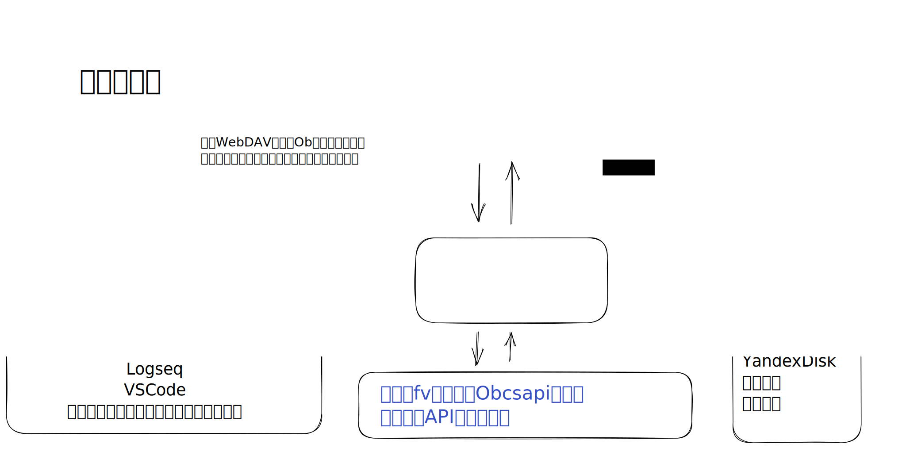
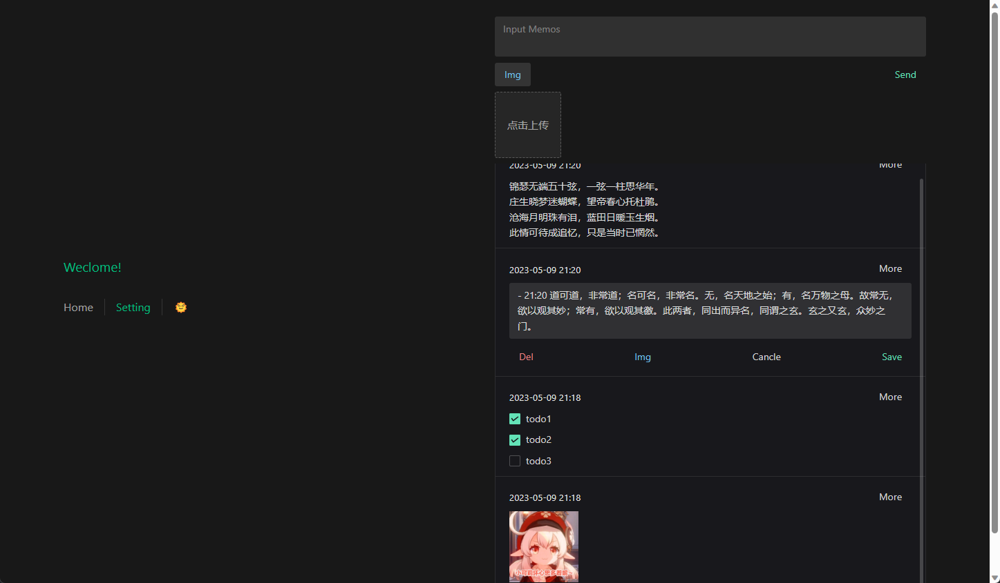
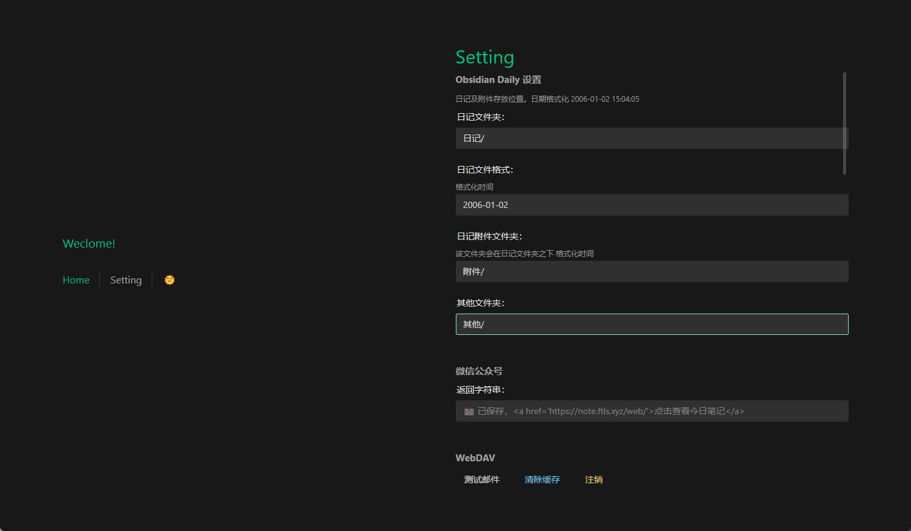

## Go 语言版本

基于 Obsidian S3 存储， CouchDb ，本地存储和 WebDAV 的后端 API ,可借助 Obsidian 插件 Remotely-Save 插件，或者 Self-hosted LiveSync (ex:Obsidian-livesync) 插件 CouchDb 方式，保存消息到 Obsidian 库。

如果你不使用 Obsidian ，也可以借助坚果云，或者 WebDav 进行文件同步，配合其他文本编辑器使用。

绘图 PowerBy [Handraw](https://handraw.top/)

可见 [https://gitee.com/kkbt/obcsapi-go](https://gitee.com/kkbt/obcsapi-go)

前端地址: 部署后访问根路径，或 [https://note.ftls.xyz/web/](https://note.ftls.xyz/web/)。

通常 [https://note.ftls.xyz/web/](https://note.ftls.xyz/web/) 为最新版本，如有 bug 请用此版本，不过可能不兼容早期服务器版本。支持 https
此外，建议使用 https://gitee.com/kkbt/web 项目 Gitee page ，可自行 fork 部署。该版本为稳定版本，可能更新不及时。支持 https/http
> 测试账户 前端登录设置
> 服务器: https://ob.ftls.xyz
> kkbt password