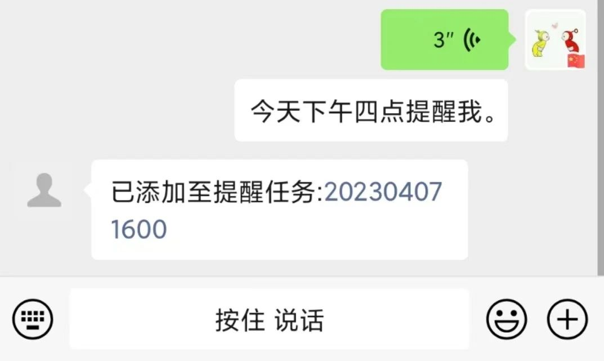

### 功能使用

接口一览

| 方式     |      验证      | 路径                | 说明                        |
| -------- | :------------: | ------------------- | --------------------------- |
| Any      | WeChat Mp 验证 | /api/wechat         | 微信测试号使用              |
| POST     |     token2     | /ob/fv              | fv 悬浮球自定义任务图文分享 |
| POST     |     token2     | /ob/sr/webhook      | 简悦 Webhook                |
| POST     |     token2     | /ob/general         | General 通用接口            |
| POST     |     token2     | /ob/url             | 页面转 md 存储 效果很一般   |
| POST     |     token2     | /ob/moonreader      | 静读天下高亮和笔记          |
| POST     |     token2     | /api/upload         | 图床 PicGo 可用             |
| GET      |       /        | /public/*           | 公开文档功能                |
| ...      |      ...       | ...                 | ...                         |

一些访问方式可见文件 [http/server.http](https://gitee.com/kkbt/obcsapi-go/blob/master/http/server.http) 或者运行后见 Swagger ，路径 `http://localhost:8900/swagger/index.html`

输出为 JSON 格式的 RJSON 可使用 Query("field") , 可选择字段：code，msg，data

```
GET {{host}}/404
响应：
{
  "code": 404,
  "msg": "Not Found",
  "data": {}
}

GET {{host}}/404?field=msg
响应
Not Found
```


#### 前端

本地 [http://localhost:8900/](http://localhost:8900/) 或者 [https://kkbt.gitee.io/web/](https://kkbt.gitee.io/web/)

支持 PWA ，部署后访问根路径即可。如 `http://localhost:8900/`

#### 本地存储 （服务器 WebDav 服务）

配置文件中设置 WebDav 相关用户名，密码, `webdav_server`值设置为 `true`。并填写的 Remotely Save 插件 Webdav 方式的服务器地址，用户名，密码中。检查同步效果。服务器地址为 `http://localhost:8900/webdav` 。前端配置账户密码和功能是否开启。

设 Obcsapi 进行二级代理后，`http://localhost:8900` 代理为 `https://examples.com/obcsapi` 。`http://localhost:8900/webdav`代理为 `https://examples.com/webdav`

Remotely Save Webdav 插件配置 服务器 `https://examples.com/webdav`  用户`kkbt` 密码 `kkbt123` 

**注意：`https://examples.com/obcsapi/webdav`在部分客户端软件正常工作，但是 Remotely Save 可能出现 Don't start with ... 情况，`http://localhost:8900/webdav`代理为 `https://examples.com/webdav` 可以解决这个问题**

本地服务 LocalStorage 本地存储，开启 Webdav 服务为 Remotely Save 提供同步。同时 WebDav 服务可连接 RAIDrive (Windows) ， Mix (安卓) 等进行文件管理。

注意：建议进行反向代理开启 https ，http 数据是在网络明文上传输的，并不安全。

虽然未我使用的 https ，但也贴出可能出现的问题。

```
微软的操作系统win7和win10对WebDAV默认只支持https协议的，需要修改注册表后才可以同时支持https和http
运行输入框中输入regedit敲回车打开注册表
在HKEY_LOCAL_MACHINE\SYSTEM\CurrentControlSet\Services\WebClient\Parameters位置，修改BasicAuthLevel 值改成2
重启webclient
```

#### 文件管理

建议使用其他软件，比如宝塔面板，或者 Alist 等程序对 Docker 暴露的文件夹进行文件管理，或修改配置。一般可选择 WebDav 的客户端。 WebDav 服务可连接 RAIDrive (Windows) ， Mix (安卓) 等进行 Obsidian 库和图床文件管理。

WebDav 下的 obnote 是 Remotely Save WebDav 的默认文件夹（由库文件夹决定）， images 是本程序图床文件夹。


RailDrive 配置示例：`examples.com` `443` `/webdav` `kkbt` `kkbt123`
Mix 配置示例：`https://examples.com` `kkbt` `kkbt123` 高级设置 `remote=/webdav`

#### 通用接口

##### 接口1
```http
POST {{host}}/ob/general
Token: {{token2}}
Content-Type: application/json

{"content":"zk 30个字符以上，并以zk 开头可以触发zk附件"}
```

以 `zk ` 开头，并且长度大于 30 可触发 zk 格式附件。

如 IOS 捷径可使用此接口，图片见 [通用接口](md/go-version/6-%E9%80%9A%E7%94%A8%E6%8E%A5%E5%8F%A3.md)


##### 接口2 flomo like

```http
POST {{host}}/ob/general/{{token2}}
Content-Type: application/json

{"content":"test From general"}
```

类似 flomo api , 除了认证方式和接口1不同，其他相同

##### 接口3 全文件通用接口
配置文件中开启功能
```yaml
general_allowed: true
```

```http
POST {{host}}/ob/generalall
Token: {{token2}}
Content-Type: application/json

{"content":"test From generalall","mod":"cover","file_key":"xxx.md"}
```


| 字段     | 必须 | 说明                                  |
| -------- | ---- | ------------------------------------- |
| content  | √    | 内容                                  |
| mod      | ×    | 留空默认append ，可选 cover,append    |
| file_key | ×    | 留空自动时间戳命名 eg: `dir/title.md` | 

file_key 默认 `支持类文件/通用接口/20060102150405.md` 格式


#### 消息通知接口

程序提供两种可以通过 API 调用的通知方式。

**！！！注意：微信模板消息施行掐头去尾，很有可能不好使！！！** 参考 [关于规范公众号模板消息的再次公告 2023 03 30](https://developers.weixin.qq.com/community/develop/doc/000a2ae286cdc0f41a8face4c51801?blockType=1&page=14#comment-list) 此外 5 月 4 日后中间的主内容中，单个字段内容不超过20个字，且不支持换行。

```http
### WechatMp 模板消息
POST {{host}}/api/wechatmpmsg
Token: {{token2}}
Content-Type: application/json

{"content":"以下是测试内容部分"}
### Mail msg
POST {{host}}/api/sendmail
Token: {{token2}}
Content-Type: application/json

{"subject":"主题","content":"以下是测试内容部分"}
```


#### Public 公开文档功能

以配置项中 `ob_daily_other_dir: 支持类文件/` 为例，在 `支持类文件/Public/`下的文档可以公开访问。如 `支持类文件/Public/test.md` 的访问路径为 `https://127.0.0.1:8900/public/test.md` 。仅支持 Markdown 文件，图片文件公开请使用图床功能。

访问 `https://127.0.0.1:8900/public/test.md?raw=true` 可请求原始文档。

该文档功能最短刷新时间是 10s , 10s 内有缓存。

#### WeChat 

微信测试号，配置完成后。微信测试号发送消息返回的链接，已保存的网址，进入前端网站，填写服务器后端URL，配置文件中设置的账户密码然后登录。若第一次显示小❌，未能自动跳转登录界面，可点击齿轮，点击注销。

##### 微信公众号说明

微信测试号发送消息，保存 Obsidian 中。前端在 https://gitee.com/kkbt/obweb 中，实例 https://kkbt.gitee.io/obweb/#/ 点击右侧图片。使用 localStorge 存储 api 地址和 token 。你可以将 https://gitee.com/kkbt/obweb frok 下来，用 Memos.md 文件内容覆盖 HOME.md ，然后借助 github pages 静态部署整个项目，这个项目整个文件夹就是一个 Obsidian 库，也是一个 Docsify 文档文件夹。如果使用对象存储的静态网站功能，可以轻松部署成网页。


- 支持图片和文字
- 图片下载到存储本地，而非链接(微信发送的图片，会给咱们的服务器返回图片URL)
- 对用户的判断，仅限特定用户存储笔记。(根据 OpenID 判断)
- 检索文字中含有 "todo" ，则生成勾选框。如 `- [ ] 13:11 somethingtodo`
- 正常生成 `- 13:11 something`
- 内容能在 Obsidian 插件 Memos 中正常显示
- 提供三天查询 一天修改的数据
- 支持消息类型: 文字，图片，链接(收藏中的)，地图位置，语音消息(直接调用微信转文字存储)

##### 企业微信自建应用说明

企业应用自建应用，API 接收消息 URL 路径为`/api/workwechat` 。然后 obcsapiv4 配置文件中填写相关参数即可，支持文字，图片，链接，不支持语音消息。支持提醒功能。

#### 微信/前端指令模式（指令模式）

微信输入支持微信文字或语音。

`对话模式 指令模式 命令模式 对话模式。 指令模式。 Talk`输入其中一个进入指令模式。

`输入模式 退出 exit Exit q` 输入其中一个退出指令模式，进入输入模式。

指令模式/对话模式需要事先准备好 `dialogues.txt`，放到运行目录下（即和 config.yaml 一个目录） 。自定义对话回复，下面是个例子。展示了随机回复，执行脚本的能力。并且指令模式/对话模式会生成日志，可使用脚本获取最后的输入。如微信输入 `自定义脚本xxx` , 程序会调用脚本，查询对话日志，找出最后一行输入，返回`I: 自定义脚本xxx`。

 
**不建议做的事情：**

- 不推荐批量传图片，推荐显示已保存后依次上传。
- 不推荐一秒内上传多个文件，图片命名精确到1S。1S内多图片会覆盖。
- 不要使用微信自带的表情符号，请使用输入法表情。
- 如果微信输入框换行或分段，只会在这一条消息最开始有 `- 13:11 `。也就是说，第二行、第二段不会在 Memos 插件中显示。


```plain
I: 你好
O: 你好呀！
O: 你好呀！有什么我可以帮助你的吗？
O: 你好呀！今天过的怎么样？

I: 今天天气
O: 无法获取天气信息。
I: 今天天气怎么样？
O: 抱歉，我暂时无法获取天气信息。这一条会被上面一条无效化。
I: 时间是多少？
O: 抱歉，我无法获取实时时钟信息。

I: 执行命令
O: 务必注意命令执行的安全性和风险，仅允许可信任和安全的命令执行。
I: 无输出命令
O: Command set a 1
I: 命令
O: Command echo "Hello,World!"
I: 天气
O: Command curl wttr.in?format=3
I: 自定义脚本
O: Command bash sh/example.sh
I: 其他注意
O: 执行命令可能会执行很长时间，造成网络响应超时。

I: 说明
O: I代表输入，O代表输出。监测包含字符串，给予对应回复。从上往下查找，如果设置为空，则必定能匹配上。程序暂时不提供对话上下文能力。

I: 
O: 必定可以匹配的到的。可以用于兜底，亦可以接入一个其他对话服务
```

最后一条，可以接入百度unit，获取更加智能的回复。示例脚本在 [https://gitee.com/kkbt/obcsapi-go/tree/master/server/sh](https://gitee.com/kkbt/obcsapi-go/tree/master/server/sh) 有提供，分别演示了获取最后一次输出，本地获取 token 内容，演示调用其他脚本等。使用 Bash 脚本，可以自定义各种各样的能力。如有 Bash 脚本编程问题，建议使用 ChatGPT 或者 New Bing 生成脚本，然后修改使用。

Docker 镜像已安装 bash , jq , curl 


#### 任务提醒


##### 微信/邮件分钟级别提醒

[登录微信测试号](https://mp.weixin.qq.com/debug/cgi-bin/sandboxinfo?action=showinfo&t=sandbox/index),模板消息接口新增测试模板，标题随意。内容处包含 `{{content.DATA}}` 即可。如

```
待办任务： {{content.DATA}}
```

创建完成后，模板ID 复制到配置文件，作为 `wechat_template_id`  的值。

库的根目录下创建 `提醒任务` .( Obsidian 会创建 提醒任务.md 文件，所以不必加后缀 .md)。内容示例如下

```md
这是一个任务提醒功能
20230407 1322 测试提醒1
20230407 1353 测试提醒2<br>第二行
```

示例中,`20230407 1322 测试提醒1` 会在 2023年04月07日 13:22 发送微信模板消息。发送后的那一行消息，按配置会被移动到 `支持类文件/WeChatSended/202304.md` 中。

该功能每分钟查询一次，所以此 `提醒任务.md` 文件不要过大。否则会引起流量过大等问题。**程序不会自动删除过期任务，或者是不符合任务提醒格式的行，需要手动确认删除无用内容**

快捷创建方式: 微信语音或文章发送包含 `提醒我` 的句子，即可添加到 `提醒任务.md`。如发送 `提醒我后天早上10:35的会议，需要及时参与` ，`提醒任务.md` 会新增 `20230407 1322 测试提醒1` 。同时后天的日记中会出现 `- [ ] 提醒我后天早上10:35的会议，需要及时参与`。

如果文字带 `发邮件提醒我` ，则到时间会发邮件提醒




使用库: https://github.com/DanPlayer/timefinder

<details>
<summary>更多示例</summary>
  <p>6月9日有一场show要去观看<br>
2021-06-09 00:00:00<br>
后天早上10:35的会议，需要及时参与<br>
2021-06-04 10:35:00<br>
明天下午三点的飞机，提醒我坐车<br>
2021-06-03 15:00:00<br>
一个小时后提醒我喝水<br>
2021-06-02 18:40:07<br>
明天早上8:00喊我起床<br>
2021-06-03 08:00:00<br>
明天早上8点喊我起床<br>
2021-06-03 08:00:00<br>
明早十点喊我喝水<br>
2021-06-03 10:00:00<br>
明天早上十点喊我喝水<br>
2021-06-03 10:00:00<br>
明天下午三点提醒我喝水<br>
2021-06-03 15:00:00<br>
一天后提醒我喝水<br>
2021-06-03 17:40:07<br>
一年后提醒我喝水<br>
2022-06-02 17:40:07<br>
一个月后提醒我喝水<br>
2021-07-02 17:40:07<br>
一月后提醒我喝水<br>
2021-07-02 17:40:07<br>
我要住到大后天<br>
2021-06-05 00:00:00<br>
我要住到明天<br>
2021-06-03 00:00:00<br>
下个月到上个月再到这个月<br>
2021-07-02 00:00:00<br>
我要住到明天下午三点十分<br>
2021-06-03 15:10:00<br>
帮我预定明天凌晨3点的飞机<br>
2021-06-03 03:00:00<br>
今天13:00的飞机<br>
2021-06-02 13:00:00<br>
3月15号的飞机<br>
2021-03-15 00:00:00<br>
昨天凌晨2点<br>
2021-06-01 02:00:00<br>
十分钟后提醒我喝水<br>
2021-06-02 17:50:07<br>
</p>
</details>


##### 邮件提醒

邮件配置正确情况下，并且配置文件中 `email_reminder_time` 处于可取的值。 Obcsapi 会读取根目录 `每日提醒.md` 和三天日记（今天，昨天，前天）中的 `- [ ]` 开头的行发送到指定邮箱中。

如果想关闭此项功能可将 `email_reminder_time` 设置为 `9999` 等数字。

邮件支持部分 HTML 标签，因此在 `每日提醒.md` 写可以实现每日随机一句话的效果。

如 https://gushi.ci/ 的返回随机古诗的图片

举例来说

```markdown
- [ ] 
- [ ] 
- [ ] 
```

效果大概这样：


在 微信-设置-通用-辅助功能-QQ邮箱提醒 中启用邮箱提醒功能，每天设置的时间就会在微信中接收到一封这样的邮件。


#### fv 悬浮球

设置自定义任务，设置分享菜单为文字，图片 POST /ob/fv ，Header Token 为 token2 的值。

[图文教程 中的 fv 部分](https://www.ftls.xyz/posts/obcsapi-fc-simple/#%E4%B8%8B%E8%BD%BD%E5%8E%8B%E7%BC%A9%E5%8C%85)

演示和教程 见 https://www.bilibili.com/video/BV1Ad4y1s7EP/

#### 简悦 Webhook 配置

简悦-服务 Webhook 填写样例

```json
{"name": "WH2COS","url": "http://localhost:8900/ob/sr/webhook","type": "POST","headers": {"Content-Type": "application/json","Token": "your_simp_read_token"},"body": {"url": "{{url}}","title": "{{title}}","desc": "{{desc}}","content": "{{content}}","tags": "{{tags}}","note": "{{note}}"}}
```


#### 每日日志分析示例


ChatGPT 分析笔记，云函数 python 3 环境部署，设置定时运作即可。使用接口需要 obcsapi 版本 >= 4.2.6
注意 虽然 python 可以使用中文作为函数名和变量名，但是括号等符号需要英文的。

```python
# -*- coding: utf-8 -*-
import logging
import json
import requests


# 变量
后端今日日志接口URL = "http://localhost:8900/ob/today"
后端接口Token ="xxx自己的token2"
ChatgptToken = "sk-xxxxxxxxxxxxx"


logger = logging.getLogger()

def AI分析笔记(文本内容):
    OpenAI的URL = "https://api.openai.com/v1/chat/completions"
    请求头 = {
        "Authorization": "Bearer "+ChatgptToken,
        "Content-Type": "application/json"
    }

    响应 = requests.post(url=OpenAI的URL, headers=请求头, json={
        "model": "gpt-3.5-turbo",
        "messages": [{"role": "system", "content": "You: " + 文本内容}]
    })

    响应的JSON = 响应.json()
    logger.info(响应的JSON)
    choices = 响应的JSON['choices']
    # logger.info(choices)
    结果 = ""

    for choice in choices:
        text = choice['message']['content']
        结果 += text

    return 结果.strip()


def 获取今日日志():
    请求头 = {
        "Token": 后端接口Token,
    }
    响应 = requests.get(url=后端今日日志接口URL,headers=请求头)
    return 响应.text

def 新增今日日志(新增的内容):
    请求头 = {
        "Token": 后端接口Token
    }
    响应 = requests.post(url=后端今日日志接口URL,headers=请求头,data=新增的内容.encode("utf-8"))

def 今日日志处理分析():
    日志文本 = 获取今日日志()
    AI提示词 = "分析下面的笔记，提炼要点并给出意见。下面为笔记内容: "
    AI返回文本 = AI分析笔记(AI提示词+日志文本)
    新增日志内容 = "\n- ChatGPT 分析: \n" + AI返回文本
    新增今日日志(新增日志内容)
    return 新增日志内容

今日日志处理分析()
```