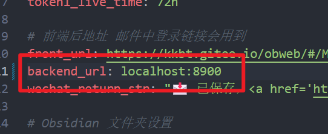

### 图床功能 PicGo 配置





POST {{host}}/api/upload
Token: {{token2}}
Content-Type: form-data

字段名: file

```json
{"data":{"url":"http://example.com/images/test.jpg","url2":"http://example.com/images/test.jpg"}}
```
~~第三行是选 url or url2 。url 是 http ；url2 是 https~~ 现在 url url2 都一样的，http/https 由配置文件决定

### 图床 PicGo-Core 类似 cli 工具

概述：用于上传到 Obcsapi 图床的专用命令行工具。可配合 Obsidian 插件 Image Auto upload Plugin ，实现 Obsidian 图片上传。

下载地址： [https://gitee.com/kkbt/obcsapi-go/tree/master/images-host-cli/out](https://gitee.com/kkbt/obcsapi-go/tree/master/images-host-cli/out)

windows，linux，mac 下

```cmd
obcsapi-picgo.exe :: 没有配置则生成配置
obcsapi-picgo.exe u .\1.png .\2.jpg :: 上传本地图片 1.png 2.jpg
obcsapi-picgo.exe u  :: 上传剪切板图片，如果有的话
obcsapi-picgo.exe u https://cdn.ftls.xyz/images/2022/11/zhishi2.jpg :: 下载网络图片，并上传
```

配置说明，第一次运行会自动生产配置。有三行
```
http://127.0.0.1:8900/api/upload
fQbzONJAAw
url
```

第一行是上传链接
第二行是 token2 的值，程序会在请求 Header Token 设置为该值
~~第三行是选 url or url2 。url 是 http ；url2 是 https~~ 现在 url url2 都一样的，http/https 由配置文件决定

除了命令行运行之外，还可配合 Obsidian 插件 Image Auto upload Plugin .选择 Picgo-Core 模式，路径选择可执行文件在的位置 如 `C:\CLI\obcsapi-picgo.exe`。也可以改名，为`picgo.exe`。

### 图床 OCR（试验性质）

图床可选配置，使用百度 OCR 进行文字识别，结果保存到 Obsidian 便于后续查询。使用 https://ai.baidu.com/tech/ocr

使用百度 OCR 通用文字识别（标准版）

配置文件中将 bd_ocr_access_token 取消注释，替换成自己的 access_token 即可，注意 access_token 有效期 30 天。  
access_token 申请 [https://ai.baidu.com/ai-doc/REFERENCE/Ck3dwjhhu](https://ai.baidu.com/ai-doc/REFERENCE/Ck3dwjhhu)

```yaml
# 百度 OCR https://ai.baidu.com/ai-doc/OCR/zk3h7xz52 该项置空或删除此项则不进行 OCR 注意该项有效期 30 天
# https://ai.baidu.com/ai-doc/REFERENCE/Ck3dwjhhu
# bd_ocr_access_token: xxxxx.xxxxx.xxxxx.xxxxx.xxxxx-xxxxx
```

数据按配置文件将保存在: `支持类文件/OcrData/bdocr.md` 。此文件可以随意删除，移动，更换名字。如果上传图片时没有此文件，程序会自动创建追加写入 OCR 结果。

